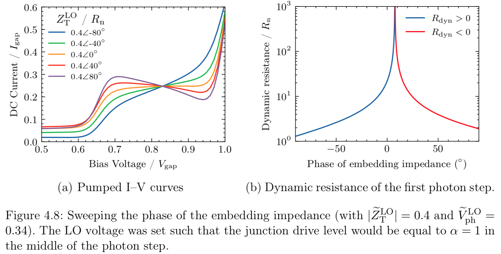

Science Plots
=============

*Format Matplotlib for scientific plotting* 

This repo has Matplotlib styles to format your plots for scientific papers, presentations or theses.

Installation
------------

Put the ``*.mplstyle`` files in your Matplotlib style directory. If you're not sure where this is, in an interactive python console type:

```python
import matplotlib
print(matplotlib.get_configdir())
```

You should get back something like ``/home/garrett/.matplotlib``. You would then put the ``*.mplstyle`` files in ``/home/garrett/.matplotlib/stylelib/`` (you may need to create the ``stylelib`` directory). If your computer is setup like mine, you can use the Makefile contained within the repo to do this automatically.

Using the Styles
----------------

Whenever you want to use one of these styles, simply add the following to the top of your python script:

```python
import matplotlib.pyplot as plt
 
plt.style.use('science')
# or
plt.style.use(['science','subfigure'])
```
In the second case, the ``subfigure`` style will override some of the parameters from the ``science`` style.

You can also use the styles temporarily by:

```python
with plt.style.context(['science']):
    plt.plot(x, y)
plt.show()
```

Contribution
------------

Please feel free to add to this repo! For example, it would be good to add styles for different journals or perhaps new color cycles.

Examples
--------




**Note:** See the ``examples/`` directory for more!
