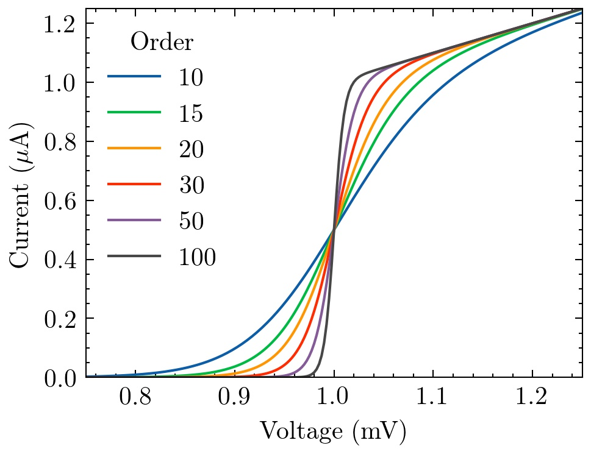
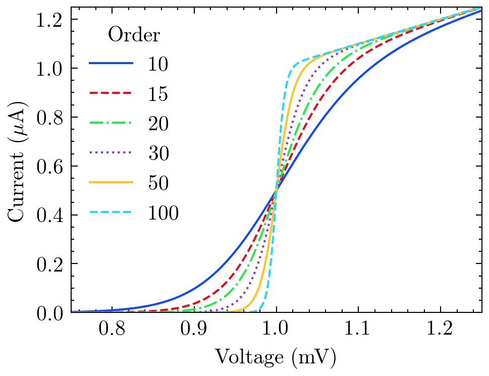
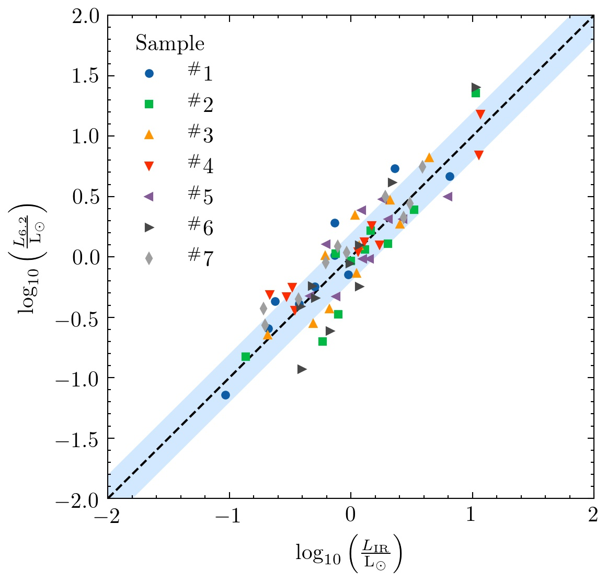
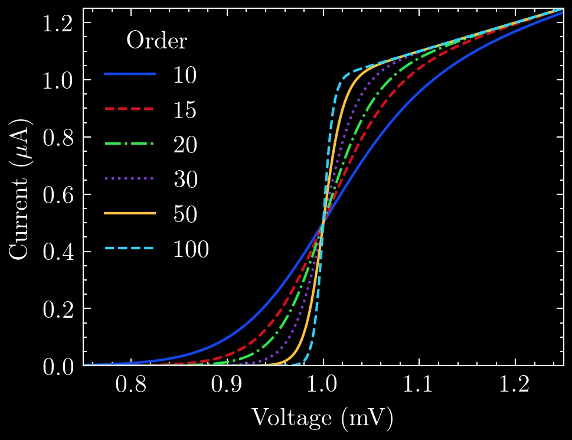
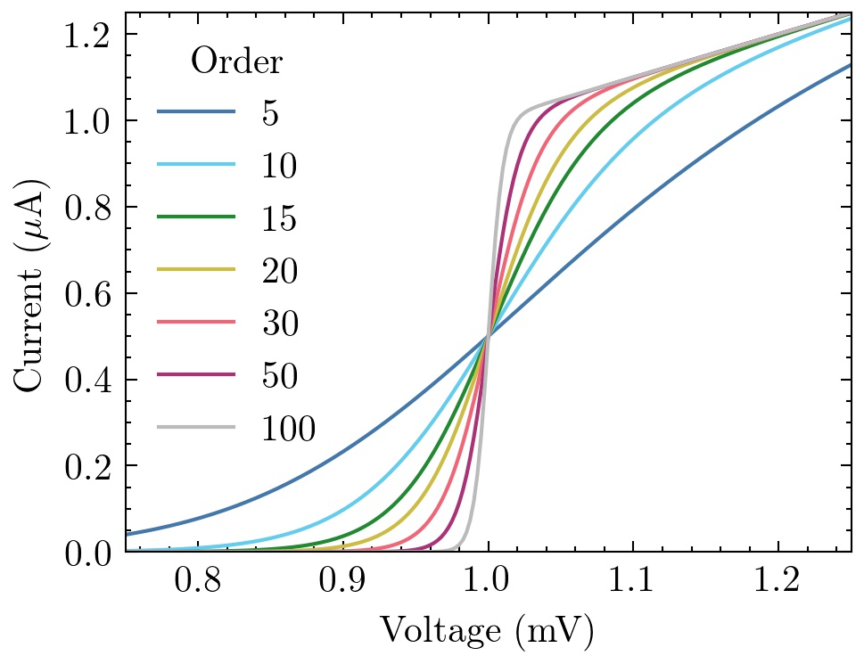
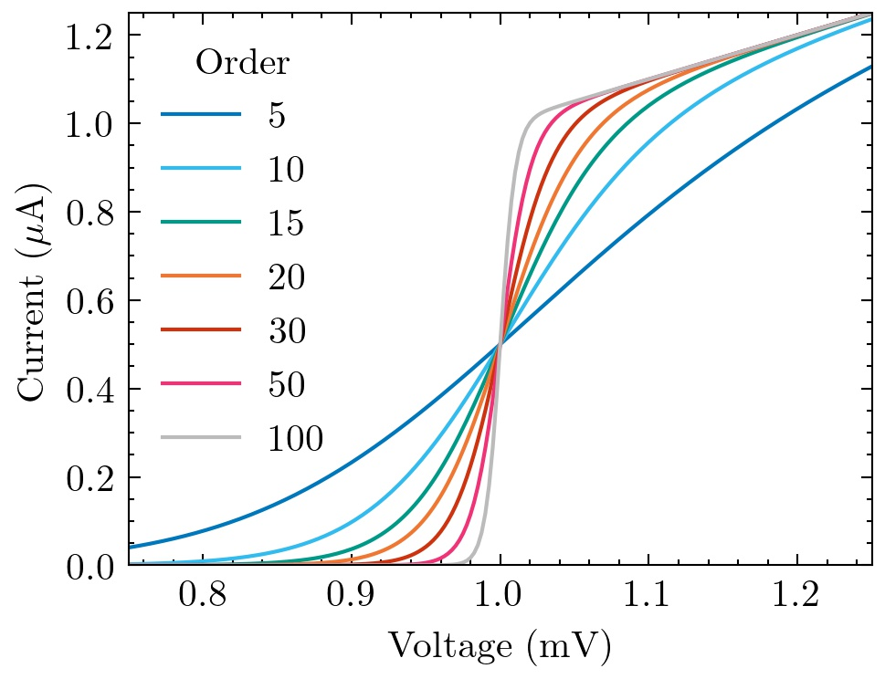
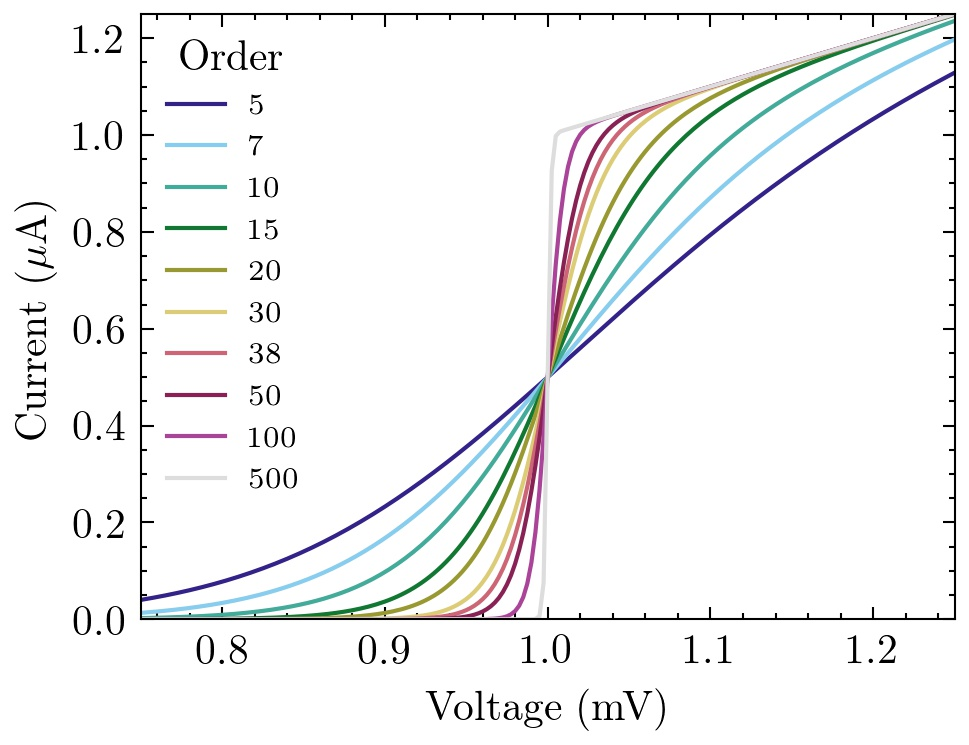

Science Plots
=============

*Format Matplotlib for scientific plotting* 

This repo has Matplotlib styles to format your plots for scientific papers, presentations and theses.

Installation
------------

Put all of the ``*.mplstyle`` files into your Matplotlib style directory. If you're not sure where this is, in an interactive python console type:

```python
import matplotlib
print(matplotlib.get_configdir())
```

You should get back something like ``/home/garrett/.matplotlib``. You would then put the ``*.mplstyle`` files in ``/home/garrett/.matplotlib/stylelib/`` (you may need to create the ``stylelib`` directory). If you're on macOS, you can run:

```bash
mkdir -p ~/.matplotlib/stylelib/
cp styles/*.mplstyle ~/.matplotlib/stylelib/
cp styles/misc/*.mplstyle ~/.matplotlib/stylelib/
cp styles/color/*.mplstyle ~/.matplotlib/stylelib/
```

Using the Styles
----------------

``science.mplstyle`` is the main style from this repo. Whenever you want to use it, simply add the following to the top of your python script:

```python
import matplotlib.pyplot as plt
 
plt.style.use('science')
```

You can also combine multiple styles together by:

```python
plt.style.use(['science','ieee'])
```

In this case, the ``ieee`` style will override some of the parameters from the main ``science`` style in order to configure the plot for IEEE papers (column width, fontsizes, etc.). 

To use any of the styles temporarily, you can use:

```python
with plt.style.context(['science', 'ieee']):
    plt.figure()
    plt.plot(x, y)
    plt.show()
```

Contribution
------------

Please feel free to add to this repo! For example, it would be good to add styles for different journals or perhaps new color cycles.

Examples
--------

The ``science`` style:



The ``science`` + ``high-vis`` styles:



The ``science`` + ``scatter`` styles:



You can also combine these styles with the other styles that come with Matplotlib. For example, the ``dark_background`` + ``science`` + ``high-vis`` styles:



**Note:** See the ``examples/`` directory for more!

Color Cycles
------------

The ``science`` + ``bright`` styles:



The ``science`` + ``vibrant`` styles:



The ``science`` + ``muted`` styles:



**Note:** The ``bright``, ``vibrant`` and ``muted`` styles are from Paul Tol's website (https://personal.sron.nl/~pault/). **They are color-blind safe.**

SciencePlots in Academic Papers
-------------------------------

The following papers use ``SciencePlots``:

- J. Garrett, *et al.*, ["Simulating the Behavior of a 230 GHz SIS Mixer Using Multi-Tone Spectral Domain Analysis,"](https://ora.ox.ac.uk/objects/uuid:0fd4537d-258c-454a-bbfb-09b1bcd88d49/download_file?file_format=pdf&safe_filename=XXXX_final.pdf&type_of_work=Journal+article) *IEEE Trans. THz Sci. Technol.*, vol. 9, no. 9, pp. 540-548, Nov. 2019.

- J. Garrett, A. Pollak, G. Yassin, and M. Henry, ["A Compact and Easy to Fabricate $E$-plane Waveguide Bend,"](https://ora.ox.ac.uk/objects/uuid:496855f9-be2a-47cd-b498-1753d8033f50/download_file?file_format=pdf&safe_filename=Waveguide_Bend__IEEE_MWCL_.pdf&type_of_work=Journal+article) *IEEE Microw. Wireless Compon. Lett.*,
vol. 29, no. 8, pp. 529-531, Aug. 2019.

- J. Garrett, ["A 230 GHz Focal Plane Array Using a Wide IF Bandwidth SIS Receiver,"](https://ora.ox.ac.uk/objects/uuid:d47fbf3b-1cf3-4e58-be97-767b9893066e/download_file?file_format=pdf&safe_filename=GarrettJ_DPhilThesis.pdf&type_of_work=Thesis) DPhil thesis, University of Oxford, Oxford, UK, 2018.

Feel free to add your paper to the list if you use ``SciencePlots``! 
